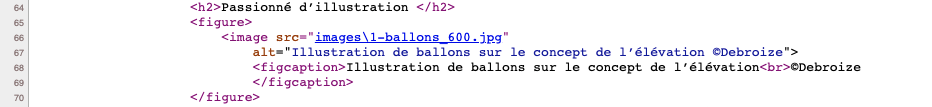
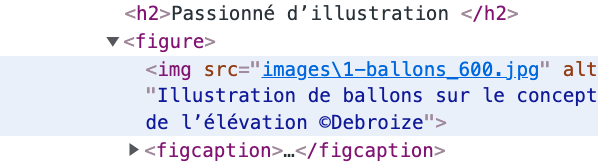

# Grille d'évaluation pour le TP2
- [X] __Balisage sémantique et structurel__ (3.4/4 points)
- [ ] __Stratégie d’intégration complétée__
- [X] __Styles CSS (base)__ (2.85/3 points)
    - charte typographique responsive
    - rangées 3-4-5-7-8
- [X] __Styles CSS (défis du header et du footer)__ (.85/1 point)
    - rangées 1-2-6
- [X] __Versionnage__ (1 point)
- [X] __Mise en ligne sur Github Pages__ (1 point)

## Note et commentaires
 9.1/10 

- Excellent travail d'intégration.   
Voir les corrections (mineures) dans le code du commit.
- Plusieurs [erreurs HTML](images/erreurs-html.pdf)
  - La principale erreur est d'avoir utilisé une balise `<image>` plutôt que ``.
  Et ce qui est formidable est que le navigateur affiche tout de même une image!  
  **Dans le html**  
    
  **Dans l'inspecteur du DOM**  
  
  
  - Une autre erreur est d'avoir utilisé des \ au lieu des / dans les chemins d'accès aux fichiers

## Barème
| Barème | sur 1 |
|--------|-------|
| A+     | 1     |
| A      | 0.95  |
| B+     | 0.9   |
| B      | 0.85  |
| C+     | 0.8   |
| C      | 0.75  |
| D      | 0.65  |
